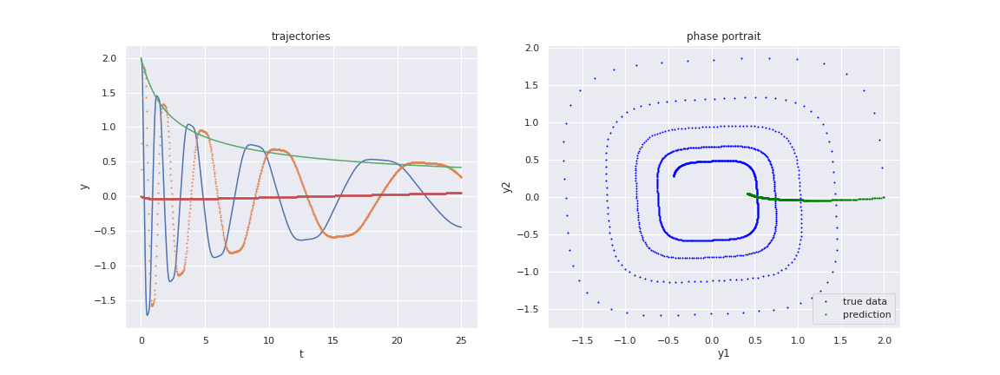
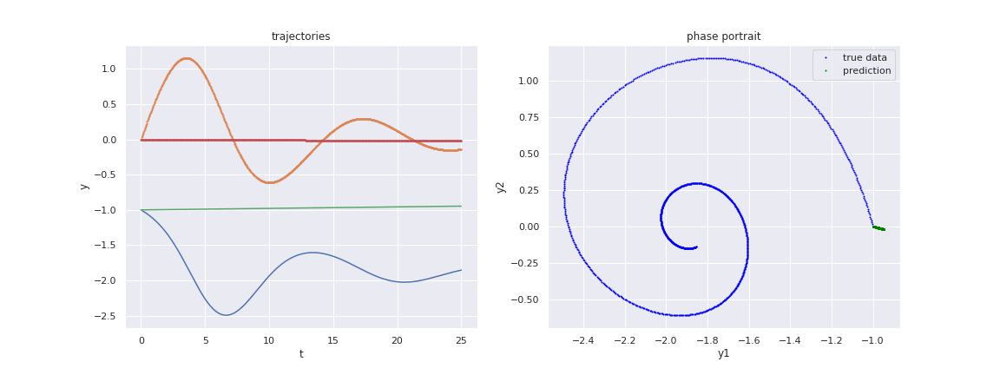

# NeuralODE_dynamics_TimeSeries

Generalize the discete form models such as RNN and GRU to continuous form by combining neural network modeling with dynamical system and ODE. 

Solving ODE to obtain the continuous hidden dynamics of neural networks models is the main direction of this repository. 

It also includes some applications of NeuralODE models in the time series modeling problems.

